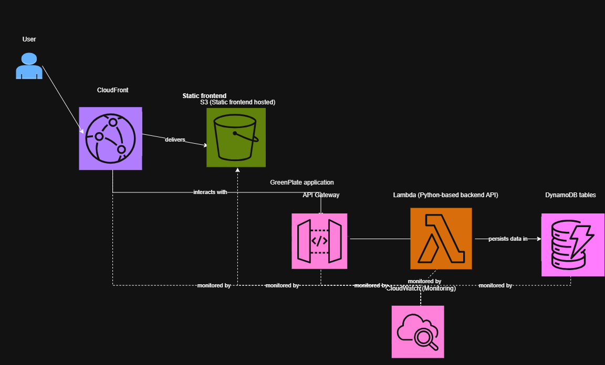
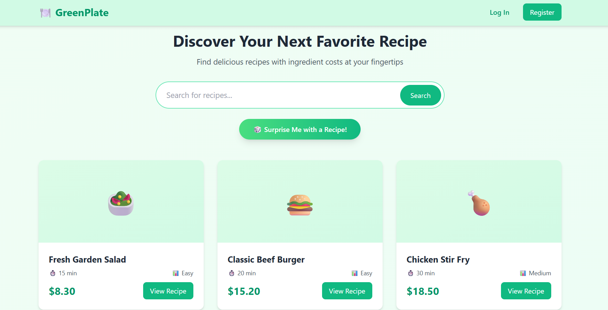
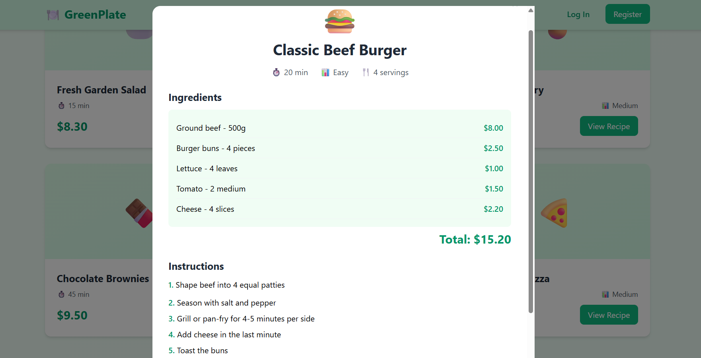
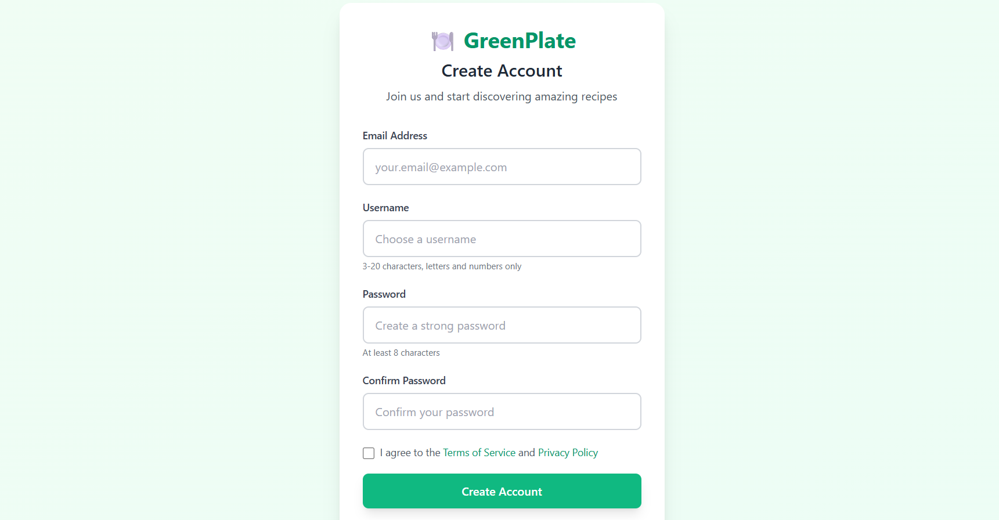
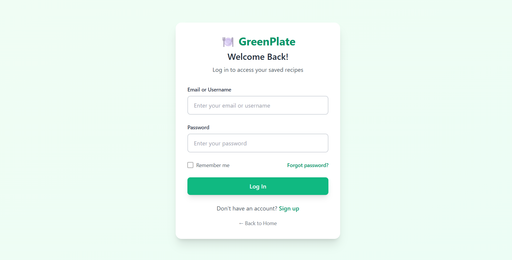
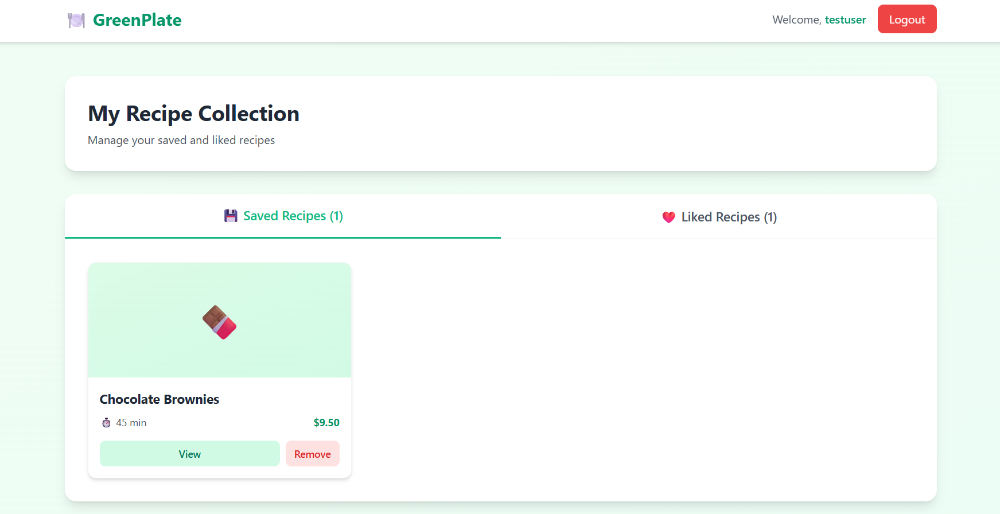

# 🍽️ GreenPlate
The GreenPlate application utilizes a serverless AWS architecture where a static frontend hosted on S3 and delivered via CloudFront interacts with a Python-based backend API on Lambda and API Gateway, which persists data in DynamoDB tables and is monitored by CloudWatch.

 🔗<a href="https://d1xb1ra74ytqwz.cloudfront.net">Check it out!</a>

## 📋 Table of Contents
- [About](#about)
- [Architecture](#architecture)
- [Features](#features)
- [App UI](#app-ui)
- [Tech Stack](#tech-stack)
- [Prerequisites](#prerequisites)
- [Local Development Setup](#local-development-setup)
- [Deployment (AWS)](#deployment-aws)
- [API Endpoints](#api-endpoints)

## ☁️ Architecture
GreenPlate is built on a fully serverless AWS architecture, ensuring scalability and cost-efficiency.

* **Frontend:** Hosted on **AWS S3** and distributed globally via **Amazon CloudFront** for low latency and HTTPS security.
* **Backend:** A **Python Flask** API running on **AWS Lambda**, managed by **Amazon API Gateway**.
* **Database:** **Amazon DynamoDB** (NoSQL) for storing users, recipes, and saved collections.
* **Infrastructure as Code:** All resources are provisioned using **Terraform**.
* **CI/CD:** Automated testing and deployment pipelines via **GitHub Actions**.



## ✨ Features
* **Recipe Discovery:** Browse and search for recipes with cost breakdowns.
* **User Accounts:** Secure registration and login (JWT Authentication).
* **Personalization:** Save favorite recipes and "like" meals.
* **Budget Focus:** See the total cost and individual ingredient prices (in Rands).
* **Dynamic Content:** AI-style recipe generation (Mock).

## 📸 App UI
* **Version 1**






## 🛠️ Tech Stack
* **Frontend:** HTML5, CSS3 (Tailwind CSS), Vanilla JavaScript
* **Backend:** Python 3.11, Flask, Boto3
* **Cloud (AWS):** Lambda, API Gateway, DynamoDB, S3, CloudFront, IAM, CloudWatch
* **DevOps:** Terraform, GitHub Actions, AWS CLI
    

## ✅ Prerequisites
Before you begin, ensure you have the following installed:
* [Node.js & npm](https://nodejs.org/) (for testing/tools)
* [Python 3.11+](https://www.python.org/)
* [Terraform](https://www.terraform.io/)
* [AWS CLI](https://aws.amazon.com/cli/) (configured with your credentials)

## 💻 Local Development Setup

To run the application locally on your machine:

1.  **Clone the Repository**
    ```bash
    git clone [https://github.com/your-username/greenplate.git](https://github.com/your-username/greenplate.git)
    cd greenplate
    ```

2.  **Set up the Backend**
    The local backend connects to your AWS DynamoDB tables (Dev environment), so ensure your AWS CLI is configured.
    ```bash
    cd backend
    python -m venv venv
    source venv/bin/activate  # On Windows: venv\Scripts\activate
    pip install -r requirements.txt
    
    # Run the Flask app
    python app.py
    ```
    *The backend will start at `http://localhost:5000`*

3.  **Set up the Frontend**
    Open a new terminal.
    ```bash
    cd frontend
    # Create a local config to point to your local backend
    echo "window.config = { apiUrl: 'http://localhost:5000' };" > config.js
    ```
    *Open `index.html` in your browser or use an extension like "Live Server" in VS Code.*

## 🚀 Deployment (AWS)

This project uses **GitHub Actions** for fully automated deployment. You do not need to manually run Terraform or upload files.

### 1. Configure GitHub Secrets
Go to your repository **Settings** > **Secrets and variables** > **Actions** and add:
* `AWS_ACCESS_KEY_ID`: Your AWS Access Key.
* `AWS_SECRET_ACCESS_KEY`: Your AWS Secret Key.

### 2. Trigger Deployment
Simply **push to the `main` branch**. The pipeline will:
1.  Package the Python backend.
2.  Deploy the infrastructure (Terraform).
3.  Update the Lambda function code.
4.  Inject the dynamic API URL into the frontend configuration.
5.  Upload the frontend to S3 and invalidate the CloudFront cache.

### 3. Access the App
Once the pipeline completes, check the "Deployment Summary" in the GitHub Actions logs for your live URL:
`https://[distribution-id].cloudfront.net`

## 🔌 API Endpoints

| Method | Endpoint | Description |
| :--- | :--- | :--- |
| `GET` | `/health` | Check API and Database status |
| `GET` | `/api/recipes` | Get all recipes |
| `GET` | `/api/recipes/search?q={query}` | Search recipes by name |
| `POST` | `/api/auth/register` | Create a new user account |
| `POST` | `/api/auth/login` | Log in and receive JWT |
| `POST` | `/api/user/saved` | Save a recipe (Requires Auth) |

---
*Built with 💚 by Luyanda Zuma*
